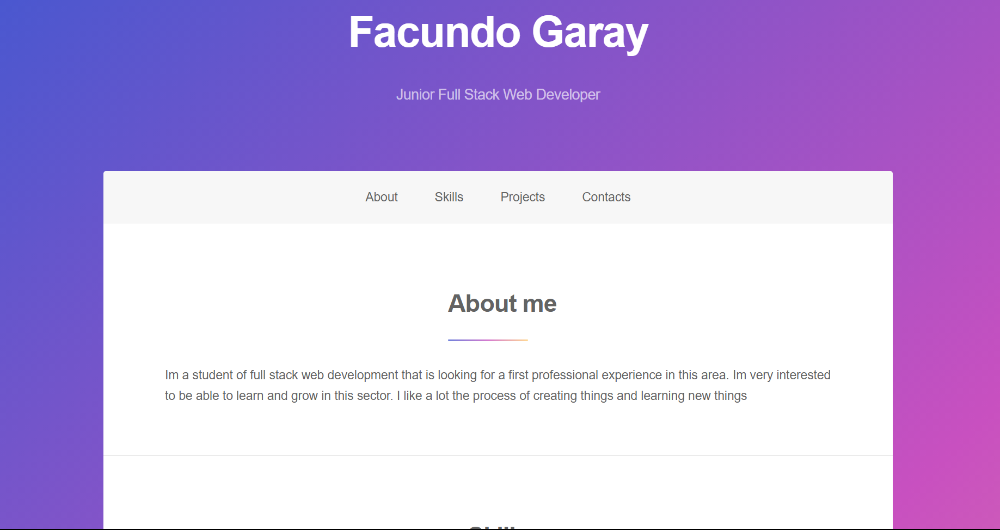

# React-Portfolio

 ## Table of Contents
  * [Description](#description)
  * [Installation](#installation)
  * [Usage](#usage)
  * [Questions](#questions)
  * [Credits](#credits)
    
  ## Description
  In this page your going to see my first portfolio created with react
  
  ## Usage
  Open the page
  
  
  ## Questions
  Have questions about this project?  
  GitHub: https://github.com/HyonNeo  
  Email: facundoega@gmail.com
  ## Credits
  Thank you to the TA for letting tips in the slack channel  
  To so many people en youtube with ideas  
  To a friend giving me tips about how to do somethings  
  
